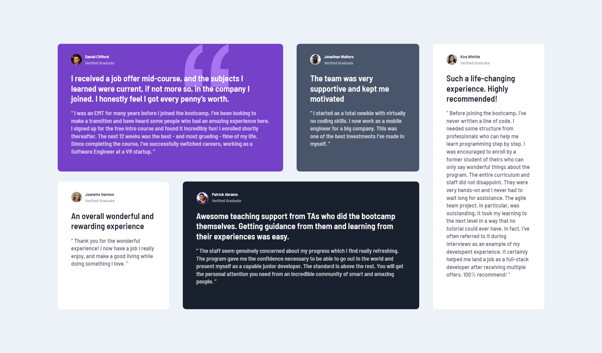

# Frontend Mentor - Testimonials grid section



This is a solution to the [Testimonials grid section challenge on Frontend Mentor](https://www.frontendmentor.io/challenges/testimonials-grid-section-Nnw6J7Un7). Frontend Mentor challenges help you improve your coding skills by building realistic projects.

### Built with

-  Semantic HTML5 markup
-  CSS custom properties
-  Flexbox
-  CSS Grid

### Links

-  Solution URL: [Add solution URL here](https://github.com/SYEDAHAMED29/testimonial-grid)
-  Live Site URL: [Add live site URL here](https://testimonial-grid-syed.netlify.app/)

## What I learned

This challenge tested my CSS grid abilities.

```HTML
<main>
 <div class="first" > First </div>
 <div class="second"> Second </div>
 <div class="third" > Third </div>
 <div class="fourth"> Fourth</div>
 <div class="fifth" > Fifth </div>
</main>
```

I used the `grid-area` property, since I found it the best way for aligning the cards.

```CSS
main{
    display: grid;
    grid-auto-columns: 1fr;
    grid-template-columns: 1fr 0.9fr 1.1fr 1fr;
    grid-template-rows: 1fr 1fr;
    gap: 24px 32px;
    grid-template-areas:
      "first first second four"
      "five third third four";
}
.first {
   grid-area: first;
}
.second {
   grid-area: second;
}
.third {
   grid-area: third;
}
.four {
   grid-area: four;
}
.five {
   grid-area: five;
}
```

## Author

-  Frontend Mentor - [@SYEDAHAMED29](https://www.frontendmentor.io/profile/SYEDAHAMED29)
-  Twitter - [@SyedAhamed29](https://www.twitter.com/SyedAhamed29)

[def]: ./screenshot.png
